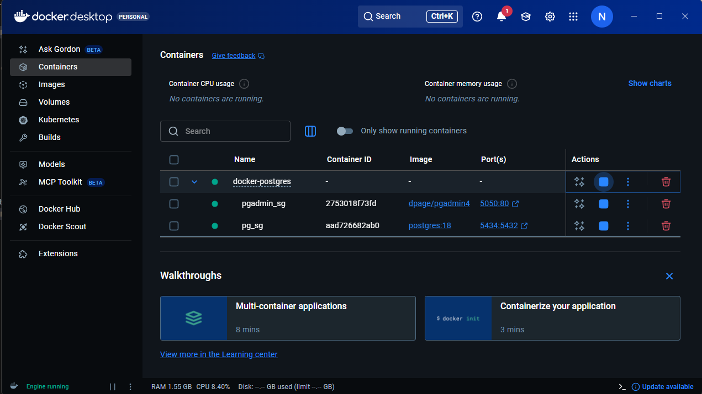
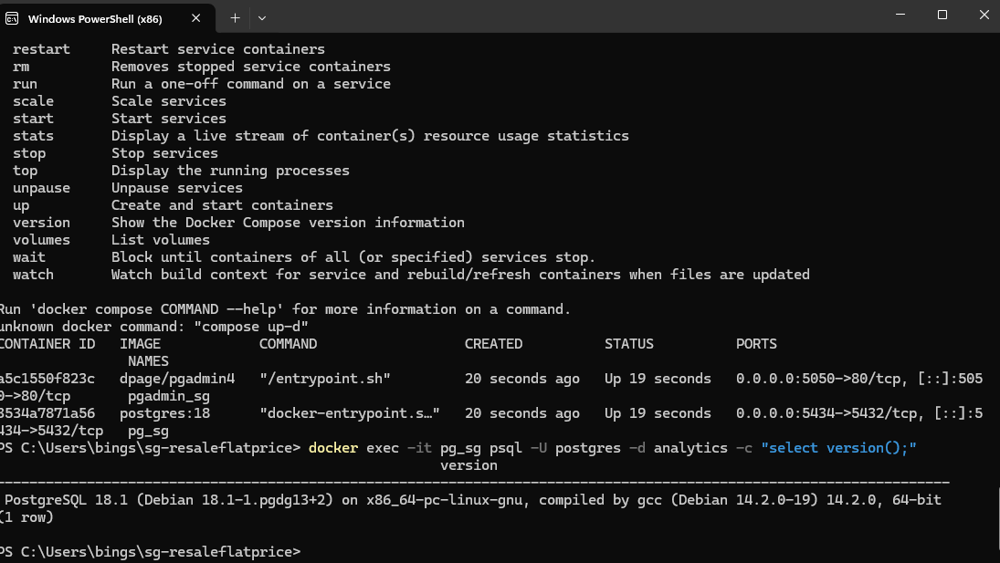

# Singapore HDB Resale Flat Price

# Introduction
Diving into public housing market in Singapore. This project explores high-value estates, high demand region, and where the high demands meeting the flat type and builds a simple end to end workflow:

**CSV dataset → Dockerized Postgres → SQL ingestion → Figma UI → PowerBI dashboard insights.**

# Background 
The purpose behind this project was driven to strengthen my SQL fundamentals, database skills, Figma UI design and PowerBI, while also exploring about data engineering and gaining a deeper understanding of Singare public housing resale market. 

The data for this project is from Singapore Government public portal [HDB Resale Price](https://data.gov.sg/collections/189/view)

Questions behind the data analysis through my project were:
1. Price trend (1990-2025):
How the median resale price have changed over time, and which time periods show the biggest jumps and dips when comparing against 12 month moving average?

2. Town price differences:
Which towns having the highest and lowest average resale price consistently, and how does that rank change when filtering by flat type and remaining lease years?

3. Transaction mix by flat model: 
Which flat models make up most of the transactions, and does a shift in flat model mix relate to changes in the overall median resale price or YoY median %?

# Tools I Used
- **Docker:** Containerized PostgreSQL + pgadmin
- **PostgreSQL:** Data storage + SQL queries 
- **pgAdmin:** DB management + query execution 
- **PowerBI:** Dashboard + DAX measures
- **Figma:** UI/UX refinement for dashboard layout
- **VSCode:** version control and README maintenance 

# Process
### 1. Create Docker + PostgresSQL
Running a local PostgreSQL database using Docker, together with pgAdmin so that when the container is up, I will be able to do SQL ingestion of the CSV into Postgres 

**1. Docker Configuration**

From the project roots, run:


*Fig 1. Docker interface*


*Fig 1.1 Docker CLI status*


*Fig 1.2 Docker Version*

**2. Postgres Database**

Connecting docker container to pgAdmin on local desktop. 

*Fig 2. pgAdmin Connection Interface* 

Checking the version that Postgres DB is connected to the container properly. 

*Fig 2.1. Database Version* 

### 2. SQL Data Ingestion
After PostgreSQL is runnning in Docker, I load the datasets from my directory into Postgres using SQL. 

**1. Create Table**

```sql
create table hdb_resale_prices(
	month text,
	town text,
	flat_type text,
	block text,
	street_name text,
	storey_range text,
	floor_area_sqm numeric,
	flat_model text,
	lease_commence_date int,
	remaining_lease text,
	resale_price numeric
); 
```

**2. Ingest dataset**

```sql
copy public.hdb_resale_prices
(
	month, town, flat_type, block, street_name,
	storey_range, floor_area_sqm, flat_model,
	lease_commence_date, resale_price
)
from 
	'/data/resale_1990_1999.csv'   -- same method for 2000-2025 dataset
with 
	(format csv, header true);
```

**3. Add ID for the table**

```sql
alter table public.hdb_resale_prices
add column hdb_id BIGINT generated always as identity;

alter table public.hdb_resale_prices
add constraint hdb_resale_prices_pkey primary key (hdb_id);
```

**4. Check for duplication**

```sql
select
	month,
	town,
	flat_type,
	block,
	street_name,
	storey_range,
	floor_area_sqm,
	flat_model,
	lease_commence_date,
	remaining_lease,
	resale_price,
	count(*) as duplicate_count
from
	public.hdb_resale_prices
group by
	month,
	town,
	flat_type,
	block,
	street_name,
	storey_range,
	floor_area_sqm,
	flat_model,
	lease_commence_date,
	remaining_lease,
	resale_price
having 
	count(*) > 1
order by
	duplicate_count DESC
limit 50;
```

**5. Delete Duplication**

```sql
with ranked as(
	select
	hdb_id,
	row_number() over (
		partition by
		month, town, flat_type, block, street_name,
		storey_range, floor_area_sqm, lease_commence_date,
		remaining_lease, resale_price
	) as row_number
	from public.hdb_resale_prices
)
delete from 
	public.hdb_resale_prices 
where 
	hdb_id in (
	select 
		hdb_id
	from 
		ranked
	where
		row_number > 1
	);
```

**6. Check for existing duplicate group**

```sql
select
	count(*) as duplicate_groups 
from (
	select
		month,
		town,
		flat_type,
		block,
		street_name,
		storey_range,
		floor_area_sqm,
		flat_model,
		lease_commence_date,
		remaining_lease,
		resale_price
	from
	 public.hdb_resale_prices
	group by
		month,
		town,
		flat_type,
		block,
		street_name,
		storey_range,
		floor_area_sqm,
		flat_model,
		lease_commence_date,
		remaining_lease,
		resale_price
	having
		count(*) > 1
);
```

**7. Create index to prevent duplication**

```sql
create unique index if not exists uq_hdb_no_duplicates
on public.hdb_resale_prices(
	month,
	town,
	flat_type,
	block,
	street_name,
	storey_range,
	floor_area_sqm,
	flat_model,
	lease_commence_date,
	remaining_lease,
	resale_price
);
```

**8. Confirming index**

```sql
select 
	indexname,
	indexdef
from 
	pg_indexes 
where 
	schemaname = 'public'
	and tablename = 'hdb_resale_prices'
	and indexname = 'uq_hdb_no_duplicates';
```

# Analysis 
After cleaning the data in power query and creating several dax measures, here is the following analysis:

### 1. HDB Resale Median Price Trend (1990-2025) - with 12 Month Moving Average


*Fig 3. Chart for HDB Median Price*

The median resale prices showing clear long-term uptrend from 1990 to 2025: 
- Growth have accelerated from the early 1990s into late 1990s 
- Growth staying flat through the early-mid 2000s 
- Rises strongly from 2008 to 2013 
- Mild dip around 2014-2019
- Prices rises again from 2020 onwards which reach new highs by 2025. 

The 12-month moving average smooths short-term fluctuations highlighting the overall upwards trajectory. 

### 2. Average HDB Resale Price by Town - Highest to Lowest

*Fig 3.1 Chart for HDB Price by Town*

- Punggol leading at around $0.49M, following by Sengkang ($0.45M) and Bukit Timah ($0.42M)
- Bishan and Pasir Ris is around $0.40M 
- Tampines and Bukit Panjang sits closer to $0.32M

Overall, this is highlighting clear location-driven pricing differences in the resale market. 

### 3. Flat Model Transaction - Share of Total Resale Transactions

*Fig 3.2 Share of Flat Model*

The resale transaction are concentrated into few flat models:
- Model A having the largest share at 38%
- Improved model at 26%
- New Generation at 10%

The remaining transaction spreading across smaller categories such as:
- Premium Apartment around 9%
- Simplified around 4%
- Other models contributing small percentage around 2-3%

Overall, the market is dominated by a few of common flat models with some of less frequent types. 

